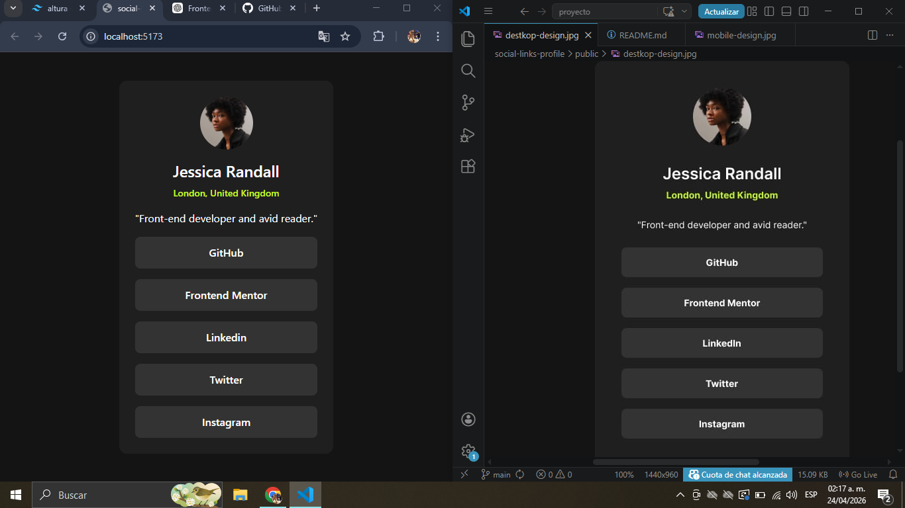

🚀 Frontend Mentor Challenge — React + Tailwind CSS
📌 Descripción del Proyecto

social-links-profile

Este proyecto corresponde a un reto de Frontend Mentor, desarrollado con el objetivo de mejorar habilidades en maquetado moderno, diseño responsive y construcción de interfaces reutilizables utilizando React y Tailwind CSS.

El desafío consistió en recrear una interfaz basada en un diseño proporcionado, respetando la estética visual, la estructura de componentes y la experiencia de usuario tanto en dispositivos móviles como de escritorio.

Durante el desarrollo se aplicaron buenas prácticas de desarrollo Front-End, organización de componentes y estilos utilitarios para lograr una aplicación limpia, escalable y mantenible.

🎯 Objetivos del Reto
º Replicar fielmente el diseño propuesto por Frontend Mentor.
º Implementar una estructura basada en componentes reutilizables.
º Construir un diseño 100% responsive.
º Utilizar Tailwind CSS para estilado moderno y eficiente.
º Mejorar la organización del código en proyectos React.
º Practicar buenas prácticas de accesibilidad y semántica HTML.

🛠️ Tecnologías Utilizadas
º⚛️ React
º🎨 Tailwind CSS
º⚡ Vite
º🧩 Componentización
º📱 Mobile First Design
º🌐 HTML5 semántico
º🎯 CSS Flexbox & Grid

✨ Características Principales
º Diseño responsive adaptable a diferentes tamaños de pantalla.
º Componentes reutilizables y escalables.
º Uso de utilidades Tailwind para estilos rápidos y consistentes.
º Optimización visual siguiendo el diseño original.
º Organización clara de carpetas y archivos.
º Código limpio y fácil de mantener.

src/
│
├── components/
│   ├── Card.jsx
│   ├── Button.jsx
│   └── ...
│
├── assets/
│   ├── images
│   └── fonts
│
├── App.jsx
├── main.jsx
└── index.css

🚀 Instalación y Uso

1️⃣ Clonar el repositorio

git clone https://github.com/tu-usuario/tu-repositorio.git

2️⃣ Instalar dependencias

npm install

3️⃣ Ejecutar el proyecto

npm run dev

4️⃣ Abrir en el navegador

📸 Preview

(Como quedo VS como debia quedar)

🧠 Aprendizajes

Durante este reto pude reforzar:

Creación de layouts responsive.
º Uso avanzado de Tailwind CSS.
º Separación lógica de componentes en React.
º Manejo eficiente del CSS sin archivos tradicionales.
º Flujo completo desde diseño hasta deploy.

👨‍💻 Autor

Desarrollado por Augusto Sánchez
Frontend Developer en formación 🚀